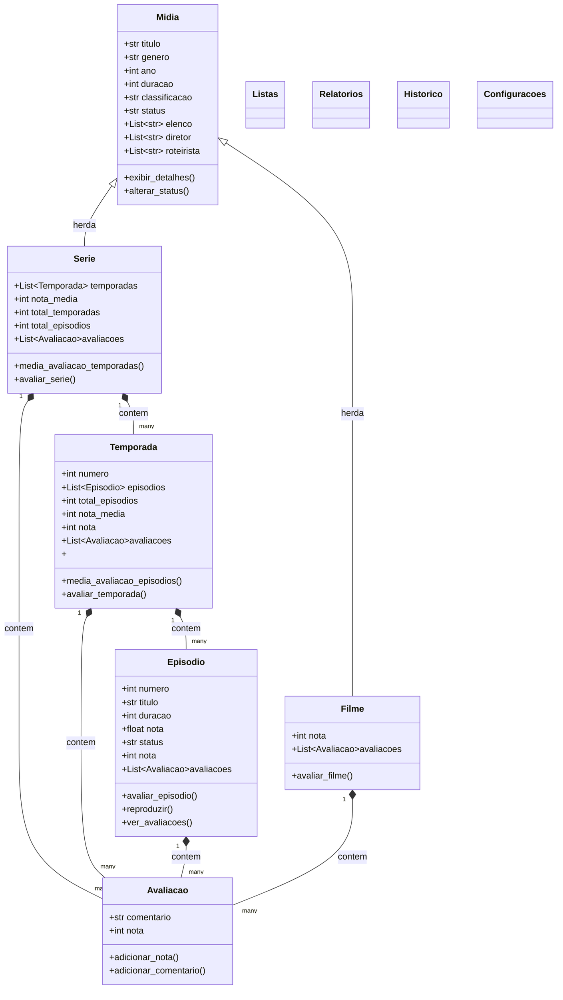

# POO-PROJETO1-TEMA-10-CATALOGO-DE-FILMES-E-SERIES
Repositório destinado ao primeiro projeto da cadeira de POO

## Descrição do Projeto e Objetivos
Desenvolver um sistema de linha de comando (CLI) ou API mínima (FastAPI/Flask, opcional) para gerenciar um catálogo pessoal de filmes e séries, com avaliações, status de visualização, temporadas/episódios, histórico e relatórios de consumo de mídia. O sistema deve permitir acompanhar o progresso de séries e comparar avaliações entre mídias. A persistência deve ser simples (em JSON ou SQLite) e a modelagem orientada a objetos deve enfatizar herança, encapsulamento, validações e composição.

## Requisitos Funcionais
### - Cadastro de mídias
Campos: título, tipo (FILME ou SERIE), gênero, ano, duração (minutos), classificação indicativa, elenco (lista), e status (NÃO ASSISTIDO, ASSISTINDO, ASSISTIDO).
Impedir duplicidade de títulos com mesmo tipo e ano.
### - Séries e episódios
- Para SERIE, registrar temporadas e episódios:
Campos: nº temporada, nº episódio, título, duração, data de lançamento, status de visualização, nota (opcional).
- Marcar série como “ASSISTIDA” quando todos os episódios estiverem concluídos.
- Avaliações
- Permitir ao usuário avaliar filmes e episódios (nota de 0 a 10).
- Calcular automaticamente a nota média da série e nota geral do catálogo.

## Estrutura de Classes

